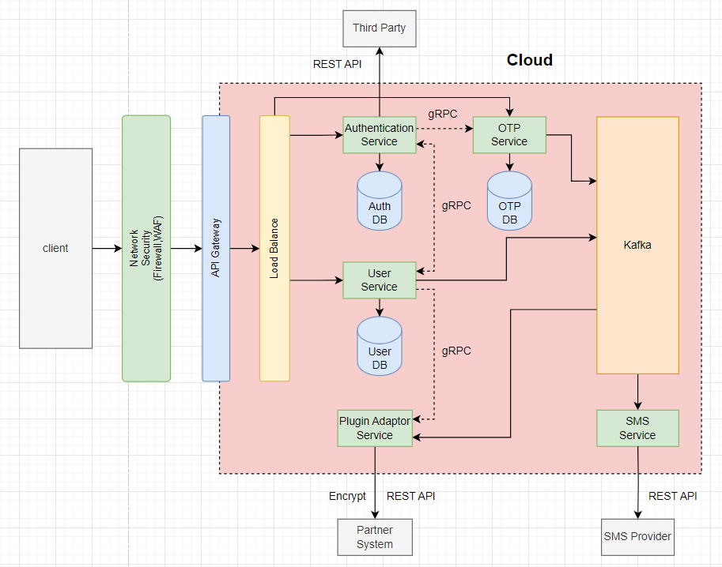

# Backend Service OTP

## Description
OTP Service is an another service of M2Ex App that is developed by microservices architecture as below



## Git

```
git remote add origin https://gitlab.com/mm860148/m2ex/backend-service-otp.git
git branch -M master
```

## Run Project

```
go mod init m2ex-otp-service
go mod tidy
go run cmd/api/main.go
```

## API Specification

Swagger UI : {add-your-domain/swagger}/index.html
```
swag init -g cmd/api/main.go --parseDependency
```

# Deployment

## Windows

```powershell
$imageName = "m2ex-otp-service"
# dev
$tagId = "1.0.rc1"
$registry = "{add-your-cloud-repository}"

# # prd
# $tagId = "1.0"
# $registry = "{add-your-cloud-repository}"

iex "docker build --rm . -t ${registry}/${imageName}:${tagId}"
iex "docker push ${registry}/${imageName}:${tagId}"

```

## Mac

```sh
imageName = "m2ex-otp-service"
# dev
tagId = "1.0.rc1"
registry = "{add-your-cloud-repository}"

# prd
# $tagId = "1.0"
# $registry = "{add-your-cloud-repository}"

eval "docker build --platform linux/amd64 --rm . -t ${registry}/${imageName}:${tagId}"
eval "docker push ${registry}/${imageName}:${tagId}"

```
